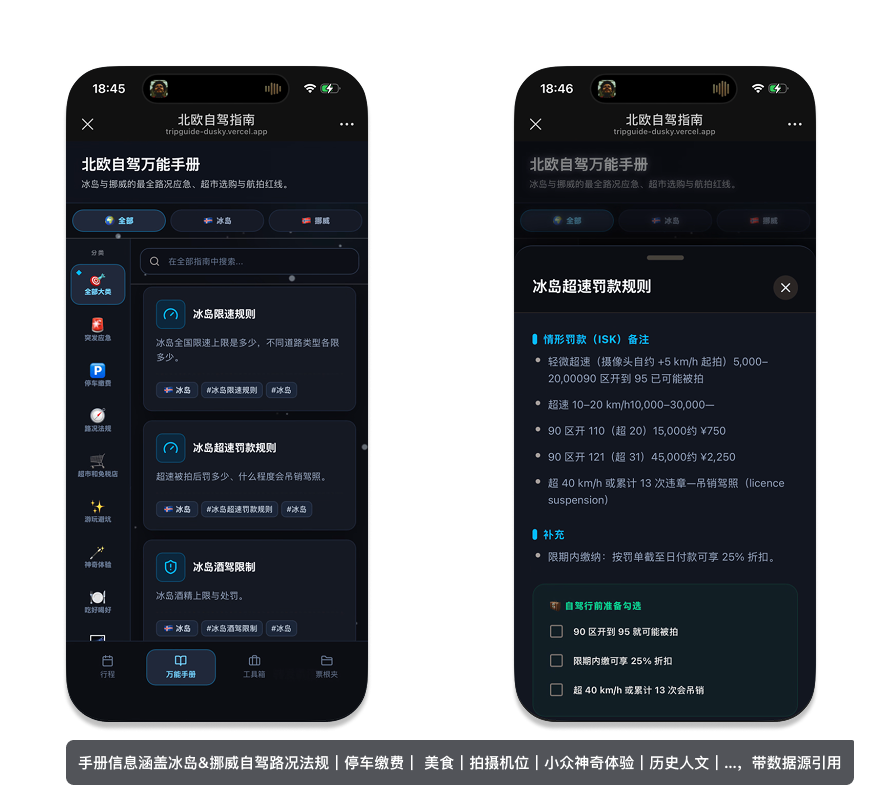
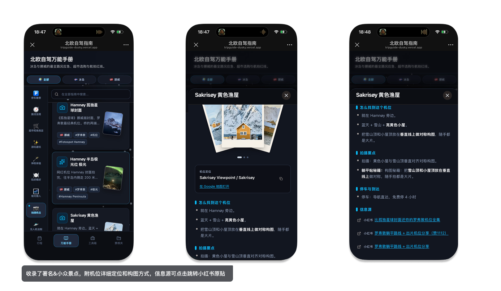
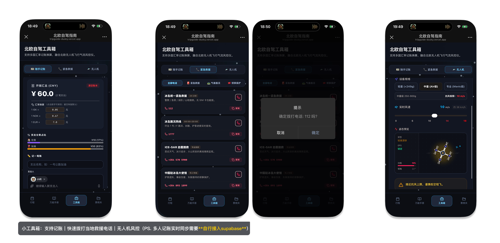
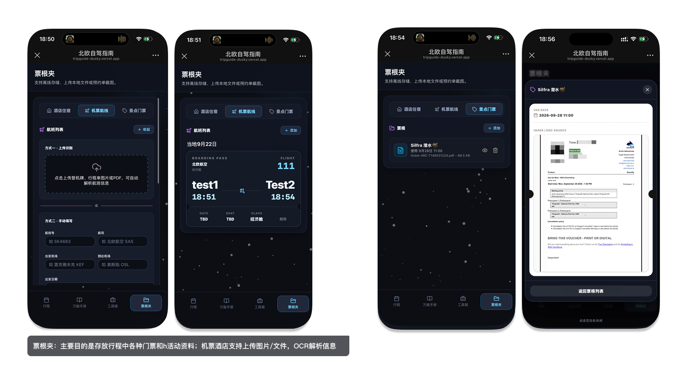

# 北欧自驾指南 · Nordic Roadtrip Guide

专为冰岛与挪威（罗弗敦）自驾旅行设计的移动端网页：路况应急、万能手册、行程时间线、随手记账与票根夹一体化。**隐私优先——所有个人数据仅存于你自己的浏览器，不上传任何服务器，也不与任何人实时同步。**

> 这是一个从私有项目开源改造而来的公开版本：移除了原有的 Supabase 多人共享后端，并用一份「冰岛 + 罗弗敦 12 天 · 香港往返」的示例行程替换了原作者的私人行程数据。

---

## 📱 产品界面

### 行程规划与地图导航

按天查看路线、景点与住宿信息，景点可一键跳转到 Google 地图。


### 北欧自驾万能手册

覆盖冰岛与挪威的交通法规、罚款规则、停车缴费、美食、拍摄机位等实用信息。





### 自驾工具箱

集成多币种记账、紧急电话和无人机风控工具。



### 票根夹

集中保存机票、酒店与景点票据，支持图片和 PDF 导入及本地 OCR 解析。



---

## ✨ 功能特性

- **万能手册**：冰岛 / 挪威最全的路况法规、停车缴费、应急电话、超市免税店、游玩避坑、极光猎人、拍摄机位、无人机红线等分类攻略。
- **行程时间线**：按天展示路线、景点、自驾里程、住宿与餐饮；支持「今日 / 已完成」自动高亮与勾选。内置一份示例 12 天行程，可自行参考替换。
- **工具箱**：
  - 随手记账：多币种（CNY / ISK / NOK / EUR）汇率换算，支持付款人分摊。
  - 无人机风控：输入实时风力，评估起飞安全与抗风等级。
  - 紧急救援：北欧紧急电话速查。
- **票根夹**：上传机票 / 酒店 / 景点门票截图或 PDF，自动 OCR 解析航班与酒店信息；支持离线存储、左右滑动预览。
- **隐私架构**：无后端、无账号、无追踪。上传的文件与记账数据以 Base64 存于本机 `localStorage`，**仅本人本机可见**。

---

## 🔒 隐私与开源说明

- 本项目**不连接任何远端数据库**，如需多人共享共享数据，可以增加 Supabase 依赖与实时同步逻辑。
- 你的行程、票根、记账全部保存在**当前浏览器**中。换设备 / 清缓存即不可见，也不会同步给其他人。
- 示例行程仅为演示数据，可自由修改为你自己的真实安排。

---

## 🚀 快速开始

需要 Node.js 18+（推荐 20+）。

```bash
npm install      # 安装依赖
npm run dev      # 本地开发，默认 http://localhost:3000
npm run build    # 产物输出到 dist/
npm run preview  # 本地预览构建产物
```

无需任何环境变量、无需配置后端。

---

## 🌐 部署

纯静态站点，可直接托管到任意静态平台：

- **Vercel / Netlify / Cloudflare Pages / GitHub Pages**：构建命令 `npm run build`，发布目录 `dist`。
- 也可 `npm run preview` 后用任意静态服务器托管 `dist/`。

---

## 🧱 技术栈

- React 19 + Vite 6 + TypeScript（strict）
- Tailwind CSS v4（`@tailwindcss/vite`）
- `motion` 动画、`lucide-react` 图标
- `tesseract.js` + `pdfjs-dist` 用于票根 OCR / PDF 解析（均在浏览器本地完成）
- 状态持久化：原生 `localStorage`，无第三方后端

---

## 📁 目录结构（节选）

```
src/
  App.tsx                    # 四底栏路由：行程 / 手册 / 工具箱 / 票根夹
  components/
    ItineraryTimeline.tsx    # 行程时间线 + 示例行程数据
    VoucherFolder.tsx        # 票根夹（机票/酒店/门票，本地 OCR）
    ExpenseTracker.tsx       # 随手记账（多币种 + 分摊）
    DroneCalculator.tsx      # 无人机风速风控
    EmergencyPhones.tsx      # 紧急电话
    ...
  data/                      # 攻略手册内容（冰岛/挪威）
  lib/
    useSharedTable.ts        # 本地优先的列表状态 Hook（localStorage）
    themeStyles.ts           # 主题配色
```

---

## 📄 License

[MIT](./LICENSE) © 2026 gasoooline
